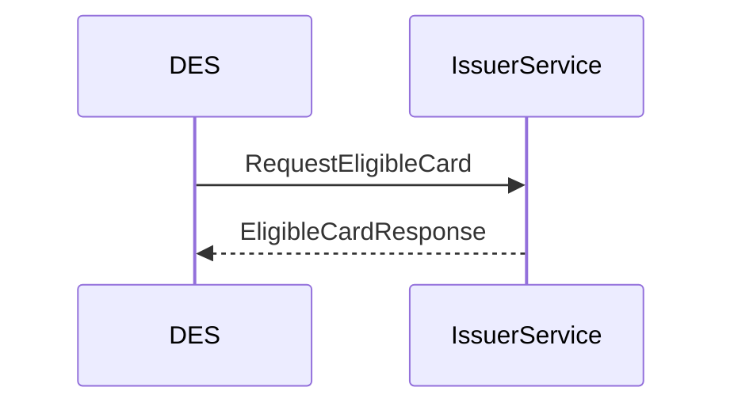
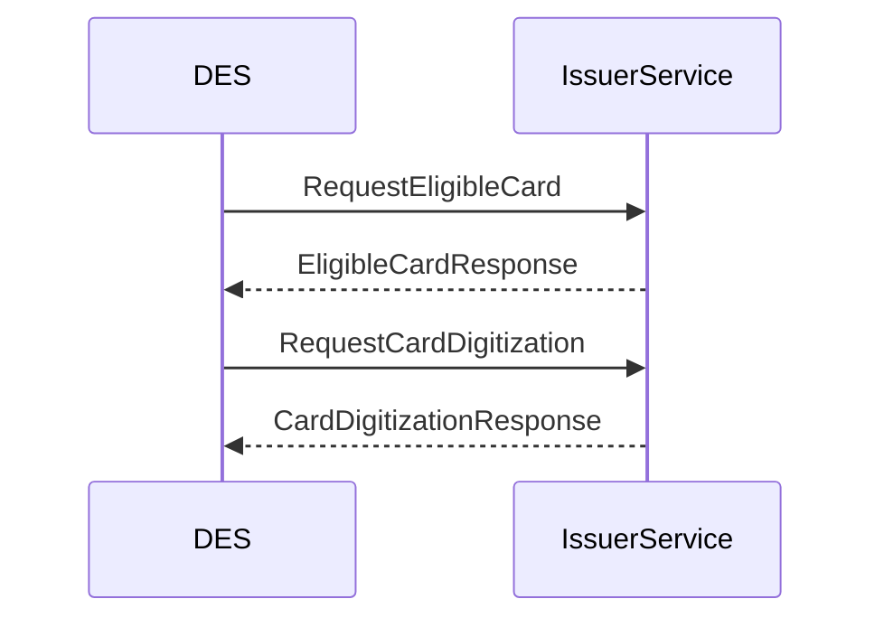
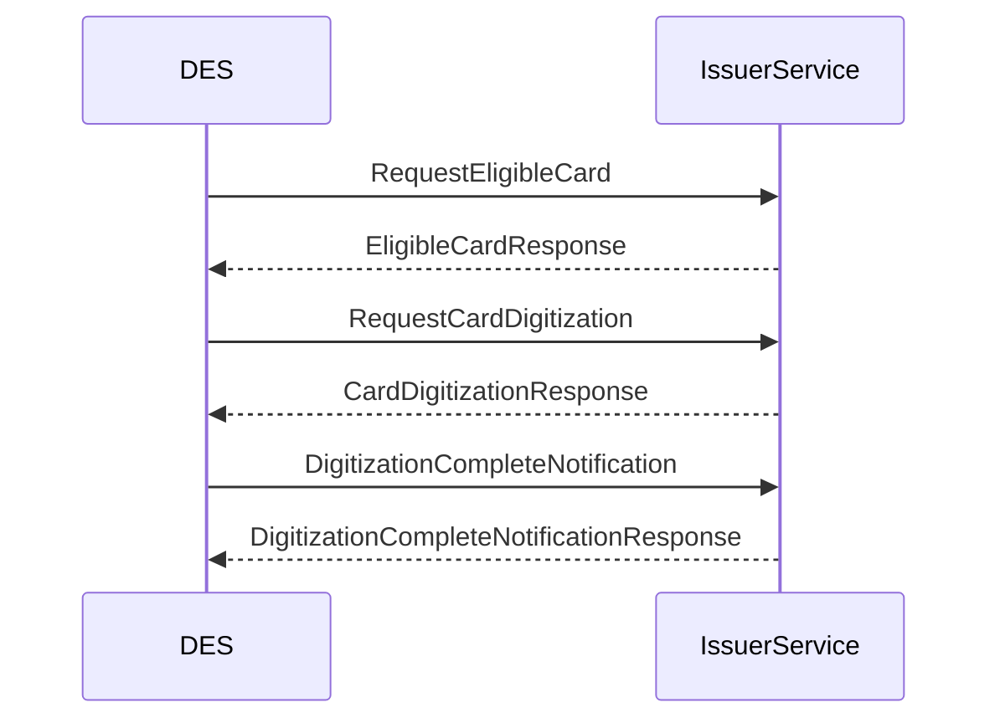

# Introduction - ePayment enrolment

To support digital BankAxept payments, a customer needs to be able to enrol their payment source.
This document outlines the enrolment needed to facilitate ePayment based payment. This flow is also applicable
for mono-badged use cases for NFC based solutions. Mono-badged is a solution where only BankAxept is used for payments.
For co-badged NFC based use cases, see our [xPays Enrolment documentation](./enrolment_xpays.md).

# Enrolment flow

In the case of an ePayment flow, the end user's bank account and NNIN is gathered by an integrator.
This information is then sent to the DES for processing.
This must then be used to retrieve the card that will be tokenized.
Once the card is deemed eligible for enrolment, the card is sent to the Issuer Processor for digitization.
Finally a confirmation is sent back to the Issuer Processor from DES.
The full specification of the requests and responses might be found in
our [[OpenAPI page](./swagger/messages-from-issuer-api.md).

Step 1: `RequestEligibleCard`

First a `RequestEligibleCard` request is sent to the DES to the Issuer Processor.
This request intends to retrieve the card that is to be tokenized.
The requests contain a bank account number and a Norwegian National Identification Number (NNIN).
The response must contain an encrypted card info as described
in the [Card Info](./enrolment_common_components.md#card-info). The full API specification of the requests and responses can be found in
the [OpenAPI page](./swagger/messages-from-issuer-api.md).

Step 2: `RequestCardDigitization`

Once a card is deemed eligible for enrolment a `RequestCardDigitization` request is sent from the DES to the Issuer Processor. This request is used to digitize
the card. The request contains information concerning:

- The card and the card capture method. (Photo, manual entry, issuer app...)
- User accepts or declines the terms and conditions.
- Risk scoring and recommendation by Wallet Provider.
- Device and wallet information.

The issuer may then approve or decline.

The response must contain a `decision`, indicating whether the card may be digitized or not.
Assuming there is a `green` decision then DES will start its' tokenization process.

Step 3: `DigitizationCompleteNotification`

Once the tokenization process is complete, the DES will send a `DigitizationCompleteNotification` to the Issuer Processor.
This is to notify the Issuer Processor that the Token is generated.
Inside the notification is the token and the token expiry date, as well as the result of the process.

