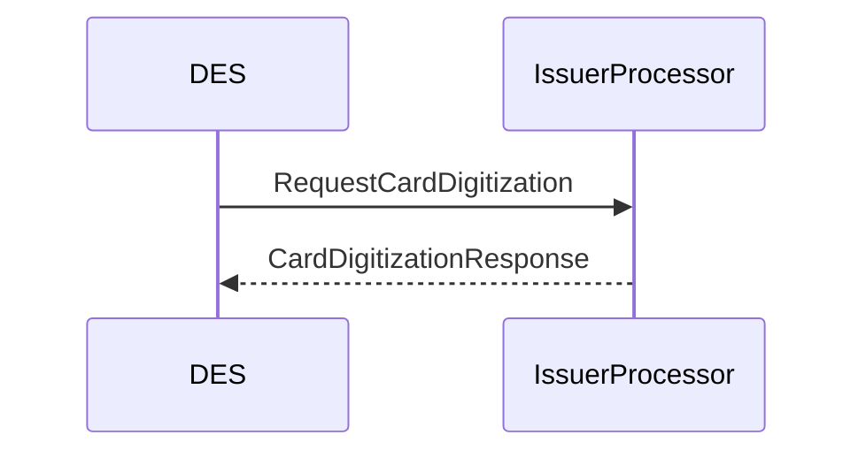
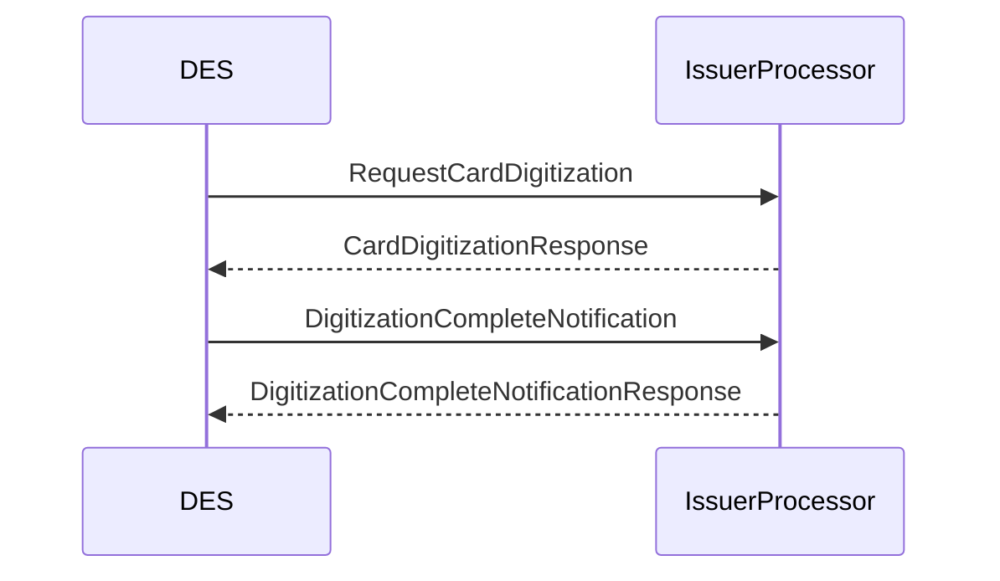

# Introduction - xPays enrolment

To enrol a card in xPays, the card is sent to DES for digitization by the wallet (Apple Pay etc.).
The card details are gathered by the wallet and sent to the DES for processing.
The DES will then send the card to the Issuer Processor for digitization.

# Enrolment flow

The full specification of the requests and responses might be found in our [TODO-Swagger documentation Task:DOM-1930](https://des.bankaxept.no/swagger/).

Step 1: `RequestCardDigitization`

Once a card is gathered by the wallet for enrolment a `RequestCardDigitization` request is sent from the DES to the Issuer Processor.
This request is used to digitize the card. The request contains information concerning:

- The card and the card capture method. (Photo, manual entry, issuer app...)
- User accepts or declines the terms and conditions.
- Risk scoring and recommendation by Wallet Provider.
- Device and wallet information.

The issuer may then approve or decline.

The response must contain a `decision`, indicating whether the card may be digitized or not. Assuming there is a `green` decision then DES will start its'
tokenization process. The card will be encrypted as described in the [Card Info](./enrolment_common_components.md#card-info).

Step 2: `DigitizationCompleteNotification`

Once the tokenization process is complete, the DES will send a `DigitizationCompleteNotification` to the Issuer Processor.
This is to notify the Issuer Processor that the Token is generated.
Inside the notification is the token and the token expiry date, as well as the result of the process.

