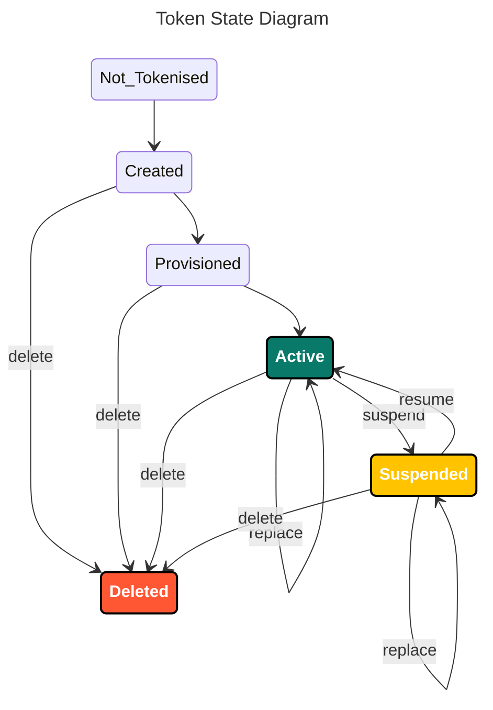

> Welcome to the Getting Started guide for the BankAxept
> DES Issuer API.
>
> This text is intended to give both clear descriptions and
> guidance for integrators and consumers of DES. It includes an
> overview of all critical features as well as some general
> hints of how to utilize this platform.

# Introduction

DES (Digital Enablement Service) Issuer API (EPP) is a Tokenization and Life Cycle Management (LCM) system delivered by BankAxept.
It is passed on synchronous calls between systems, consisting of the DES Issuer API as well as an expected Issuer side API for receiving callbacks from the DES
system.

## Setting up your DES integration

There are multiple points of configuration that need to be aligned before you can fully utilize the DES Issuer API. The necessary steps may be found in our
[Onboarding Guide](./onboarding.md).

## Integration Guidelines

### TID (Trace Identifier)

All requests must be done using a TID. This is a unique identifier for each request, and must be included in the header of each request. We recommend using a
robust UUID generator for this. For example, UUIDv4.

### ProcessId

Is used in enrolment. Must be provided as part of all subsequent API calls to or related to the same enrolment session.

### Timestamps

All timestamps must be in UTC and in ISO8601 format YYYY-MM-DDThh:mm:ss.
We recommend using a library for this, as it is crucial not to make mistakes with timestamps.

## Checklist before going live.

| Action point       | Description                                                                      |
|--------------------|----------------------------------------------------------------------------------|
| Set up MTLs        | A certificate exchange must performed and mTLS must be enabled for all endpoints |
| Token Requestor Id | To be communicated                                                               |

## Token states.

Here is an overview of all the accepted state change for a token:

The Card is always considered in an active state by DES, also when the card is Deleted.
This is since the issuers are handling the card state while DES is only handling the token state.

# Terminology

See our [Dictionary](./dictionary.md) for a list of terms used in the BankAxept ecosystem.

# Response Codes

The following response codes are used in the API. These might be changed or expanded in the future.

| Response Code | Description                                                                                                                                                          |
|---------------|----------------------------------------------------------------------------------------------------------------------------------------------------------------------|
| 0             | Success                                                                                                                                                              |
| 100-999       | Wallet-related error codes                                                                                                                                           |
| 113           | Unknown issuer                                                                                                                                                       |
| 115           | Unknown product                                                                                                                                                      |
| 116           | Unknown card (service code unknown etc.)                                                                                                                             |
| 119           | Unknown virtual card                                                                                                                                                 |
| 221           | Device or Wallet Provider not accessible after retries                                                                                                               |
| 322           | Time to live of the operation expired                                                                                                                                |
| 911           | Operation failed                                                                                                                                                     |
| 921           | Unexpected server error                                                                                                                                              |
| 1000          | Not found                                                                                                                                                            |
| 1001          | Illegal operation                                                                                                                                                    |
| 1002          | Card expired                                                                                                                                                         |
| 1003          | Card suspended                                                                                                                                                       |
| 1004          | Card revoked or deleted                                                                                                                                              |
| 1005          | No eligible card found                                                                                                                                               |
| 1006          | Card not activated                                                                                                                                                   |
| 1009          | Invalid change of state                                                                                                                                              |
| 1010          | Invalid change of state since the token is deleted                                                                                                                   |
| 1011          | Card already exists in the DES with same PAN, card sequence number and expiry date. Only deleted tokens pointing to the card to be replaced exist in the DES.        |
| 1012          | Card already exists in the DES with same PAN, card sequence number and expiry date. Active or suspended tokens pointing to the card to be replaced exist in the DES. |
| 1013          | Card already exists in the DES with the same PAN, card sequence number but different expiry date.                                                                    |
| 2000          | Missing parameter                                                                                                                                                    |
| 2001          | Invalid format                                                                                                                                                       |
| 3000          | Internal error (Server error)                                                                                                                                        |
| 3001          | Internal error (General error)                                                                                                                                       |
