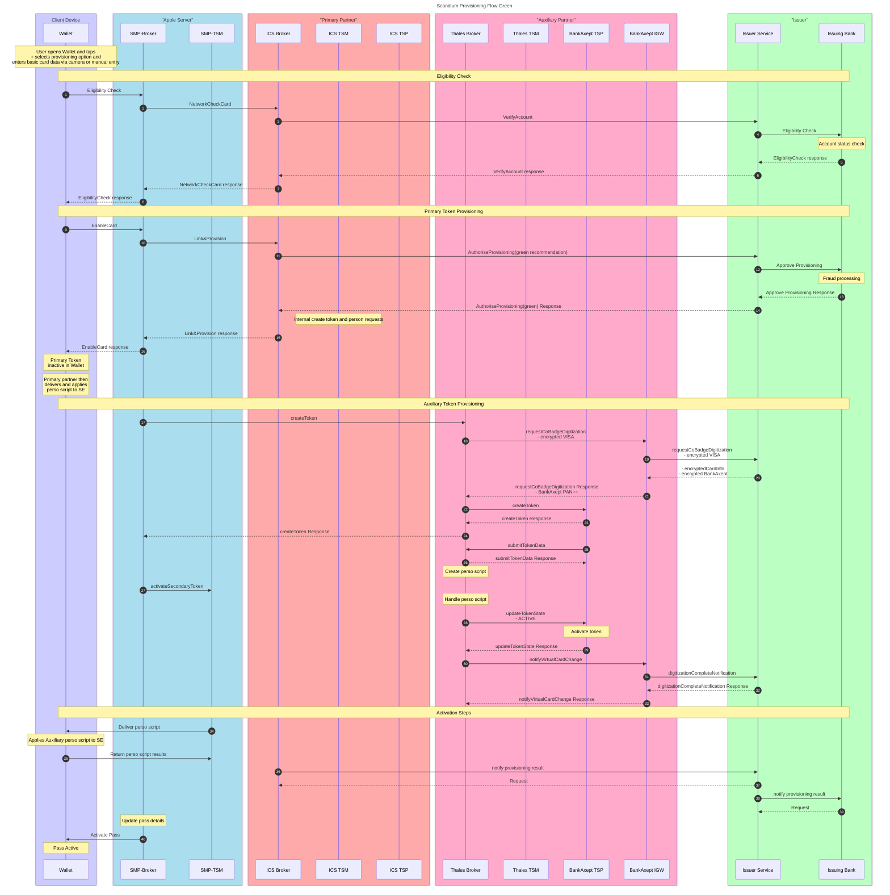
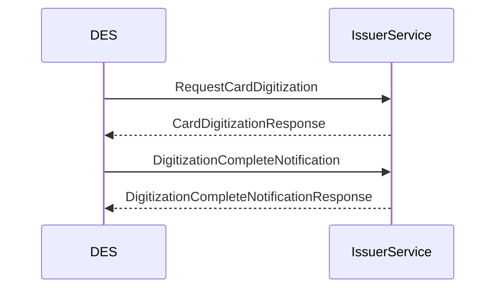
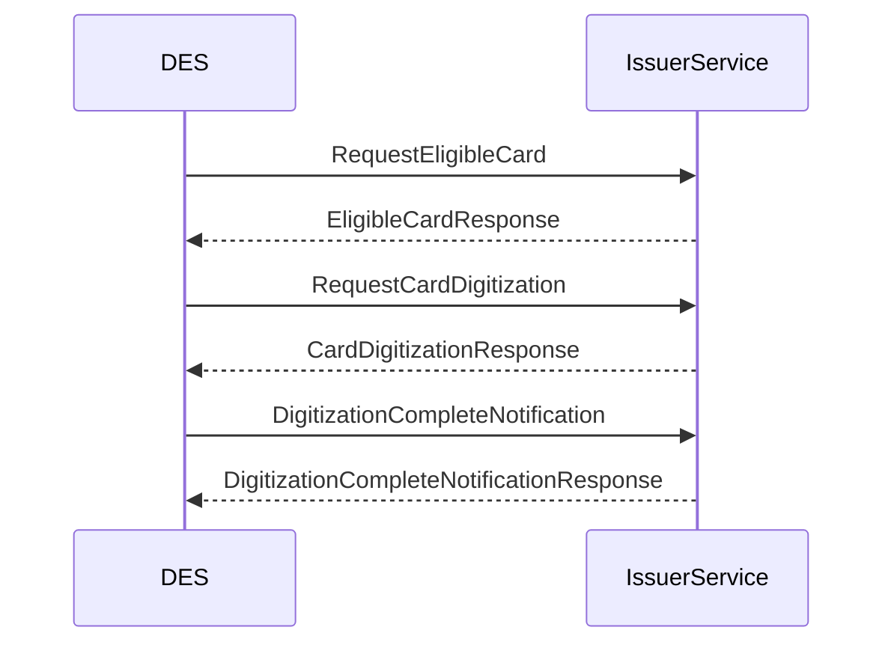

# Tokenization

## Introduction

DES provides digitization, tokenization, provisioning and lifecycle management of payment credentials.
This is being performed on behalf of Norwegian issuers and is achieved through a connection with a Baltus Node.

This documentation outlines the interplay between the DES Issuer API and the Issuer Processor. It does not go into depth on the ecosystem outside this
relationship.

### xPays

DES may be utilized for tokenization for various xPays. This enables BankAxept to tokenize on behalf of the BankAxept Issuing Banks.
Below is an illustration representing the ecosystem in which DES operates.

### HCE wallets

DES may be utilized for tokenization for HCE wallets. This enables BankAxept to tokenize on behalf of the BankAxept Issuing Banks.
Below is an illustration representing the ecosystem in which DES operates.

## Tokenization flow

## Full overview

This is intended as an overview of the tokenization process in the ecosystem in a co-badged setting.
Very rarely does a single actor need to know the full process.
This is intended more of a reference for understanding the full process.
Please peruse our [dictionary](./dictionary.md) for term explanation.

BankAxept's role can be seen in the Auxiliary token provisioning step, note that for epp and mono-badged it is performed as seen in
the [EPP flow](#epp-flow). The IGW (Issuer Gateway) is DES's service for interfacing with the Issuer Service.

### xPay Flow

See the dedicated section for more information [here](./enrolment_xpays.md).
Once an entity(xPay etc.) has started a tokenization process, the following flow is expected between the Issuer Processor and DES.

### EPP flow

See the dedicated section for more information [here](./enrolment_epayment.md).
Once an entity(xPay etc.) has started a tokenization process, the following flow
is expected between the Issuer Processor and DES.

